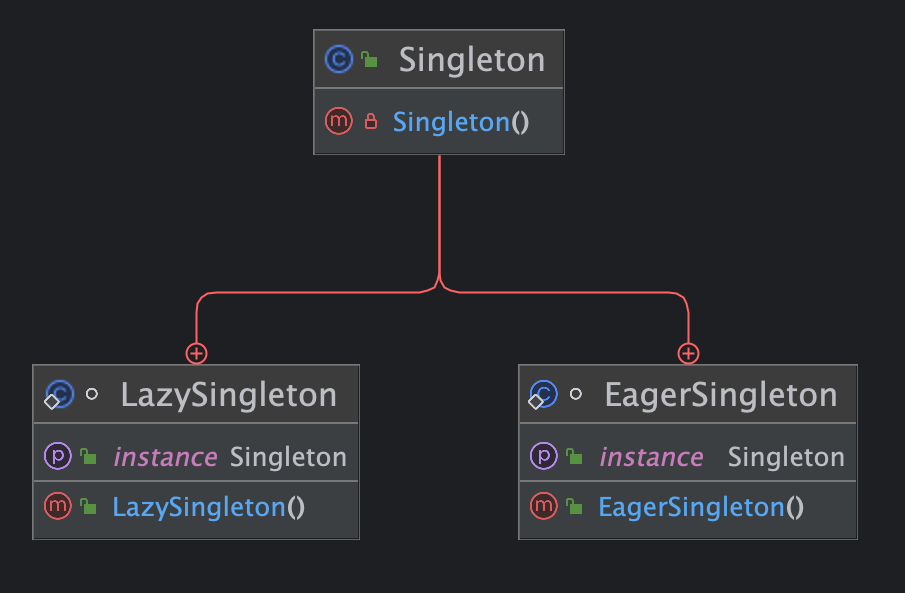

# 单例模式

## 定义

> 单例模式（Singleton Pattern）是一种创建型设计模式,它确保类只有一个实例,并提供全局访问点.这意味着单例类只能有一个实例对象,并且该实例对象可以在系统中的任何地方被访问.


## 要素

1. **私有构造函数（Private Constructor）**：确保其他类无法直接实例化单例类.
2. **静态成员变量（Static Member Variable）**：用于保存单例实例的引用.
3. **静态获取方法（Static Get Method）**：提供全局访问点,用于获取单例实例.


## UML类图




## 示例

```java
/**
 * 单例类
 */
public class Singleton {


    /**
     * 私有化构造方法
     */
    private Singleton(){}


    /**
     * 懒汉单例模式
     */
    static class LazySingleton {

        /**
         * 对象实例
         */
        private static volatile Singleton instance;


        /**
         * 获取对象实例
         * @return Singleton
         */
        public static Singleton getInstance() {
            // 双重锁定检查
            if (instance == null) {
                synchronized (Singleton.class) {
                    if (instance == null) {
                        instance = new Singleton();
                    }
                }
            }
            return instance;
        }
    }


    /**
     * 饿汉单例模式
     */
    static class EagerSingleton{

        /**
         * 对象实例
         */
        private static final Singleton instance = new Singleton();


        /**
         * 获取对象实例
         * @return Singleton
         */
        public static Singleton getInstance(){
            return instance;
        }
    }
}
```


## 优点

1. **全局访问点**：单例模式提供了一个全局访问点,可以在程序的任何地方访问该实例,方便了对象的访问和管理.
2. **节约资源**：由于单例模式只创建一个实例,因此可以节约系统资源,特别是对于需要频繁创建和销毁的对象,如数据库连接、线程池等.
3. **避免重复创建**：单例模式确保一个类只有一个实例存在,避免了重复创建相同对象的开销,提高了性能.
4. **实现了延迟加载**：某些单例模式的实现方式（如懒汉式）在需要时才会创建实例,实现了延迟加载,节约了内存资源.
5. **线程安全**：部分单例模式的实现方式（如双重检查锁定、枚举）可以保证在多线程环境下的线程安全性,避免了多线程竞争导致的问题.


## 缺点

1. **可能引起性能问题**：某些单例模式的实现方式（如懒汉式、双重检查锁定）在多线程环境下需要进行同步操作,可能会引起性能问题.
2. **可能造成资源浪费**：某些单例模式的实现方式（如饿汉式）在类加载时就创建实例,可能会造成资源的浪费,特别是在实例不被频繁使用的情况下.
3. **可能引起单点故障**：由于单例模式只有一个实例,如果该实例出现问题,整个系统可能会受到影响,存在单点故障的风险.
4. **不利于扩展**：单例模式将对象的创建和管理集中在一个类中,不利于系统的扩展和维护,可能会导致类的职责过重.
5. **隐藏了依赖关系**：使用单例模式会隐藏类之间的依赖关系,增加了代码的耦合度,不利于代码的理解和维护.