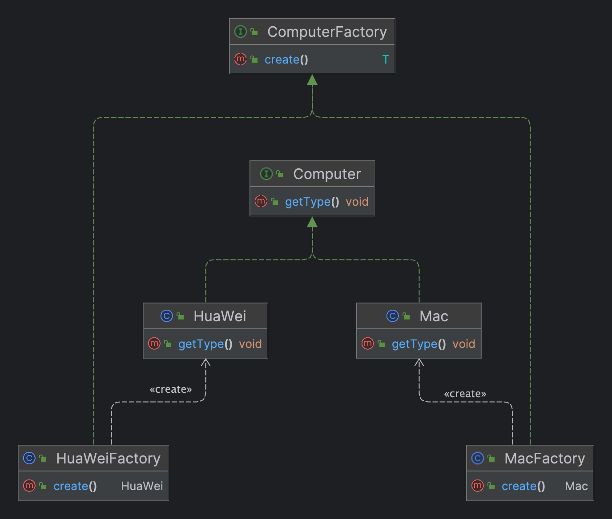

# 工厂方法模式

## 定义

> 工厂方法模式（Factory Method Pattern）是一种创建型设计模式,它定义了一个用于创建对象的接口,但是将对象的实际创建延迟到子类中.


## 要素

1. **抽象产品（Abstract Product）**：定义了产品对象的接口或抽象类,具体的产品类实现了这个接口.
2. **具体产品（Concrete Product）**：实现了抽象产品接口的具体对象.
3. **抽象工厂（Abstract Factory）**：定义了创建产品对象的工厂方法,返回一个抽象产品类型的对象.
4. **具体工厂（Concrete Factory）**：实现了抽象工厂接口,负责创建具体的产品对象.


## UML类图




## 示例

- 抽象工厂

  ```java
  /**
   * 电脑工厂接口
   */
  public interface ComputerFactory {
    
      <T extends Computer> T create();
  }
  ```

- 具体工厂

  ```java
  /**
   * 华为工厂类
   */
  public class HuaWeiFactory implements ComputerFactory{
  
      @Override
      public HuaWei create() {
          return new HuaWei();
      }
  }
  ```

  ```java
  /**
   * Mac工厂类
   */
  public class MacFactory implements ComputerFactory{
  
      @Override
      public Mac create() {
          return new Mac();
      }
  }
  ```

- 抽象产品

  ```java
  /**
   * 电脑类接口
   */
  public interface Computer {
    
      void getType();
  }
  ```

- 具体产品

  ```java
  /**
   * 华为电脑类
   */
  public class HuaWei implements Computer{
  
      @Override
      public void getType() {
          System.out.println("MateBook 14 32G 2T 2023 冷锋蓝(遥遥领先)");
      }
  }
  ```

  ```java
  /**
   * Mac电脑类
   */
  public class Mac implements Computer{
  
      @Override
      public void getType() {
          System.out.println("MacBook Pro M3Ultra 32G 2T 2023");
      }
  }
  ```

- 测试类

  ```java
  /**
   * 测试类
   */
  public class Main {
  
      public static void main(String[] args) {
          // 创建不同类型的工厂
          ComputerFactory macFactory = new MacFactory();
          ComputerFactory huaWeiFactory = new HuaWeiFactory();
          // 调用工厂创建对象
          Mac mac = macFactory.create();
          HuaWei huaWei = huaWeiFactory.create();
          // 查看品牌
          mac.getType();
          huaWei.getType();
      }
  }
  ```
  


## 优点

1. **符合开闭原则**：工厂方法模式通过将对象的创建延迟到子类中,使得新增产品类型时只需添加新的具体工厂类和具体产品类,而不需要修改现有的代码,从而符合开闭原则.
2. **封装性好**：工厂方法模式将对象的创建逻辑封装在具体工厂类中,客户端无需知道具体的产品类名,只需要通过工厂方法获取所需的产品对象即可,降低了客户端和具体产品类的耦合度.
3. **扩展性好**：由于具体工厂类负责创建具体的产品对象,因此可以根据需要灵活地扩展和变化具体的产品对象类型,而不影响其他部分的代码.
4. **支持产品族创建**：工厂方法模式支持创建产品族（相关联的一组产品）,因为每个具体工厂类可以创建一组相关的产品对象.
5. **单一职责原则**：每个具体工厂类只负责创建一种产品对象,从而符合单一职责原则.


## 缺点

1. **类的数量增加**：引入工厂方法模式会增加系统中类的数量,每个具体产品都需要对应一个具体工厂类,这会增加代码的复杂度.
2. **增加了系统抽象性**：工厂方法模式引入了抽象工厂和抽象产品的概念,增加了系统的抽象性和理解难度.
3. **可能导致继承结构复杂**：如果产品种类很多,需要创建大量的具体工厂类和具体产品类,这可能导致继承结构变得复杂.
4. **不够灵活**：每个具体产品都需要对应一个具体工厂类,如果产品类型比较多且频繁变化,可能需要频繁地新增具体工厂类,不够灵活.