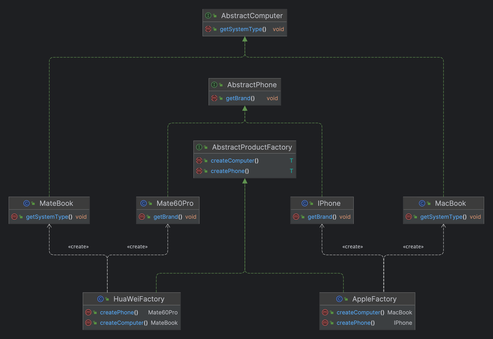

# 抽象工厂模式

## 定义

> 抽象工厂模式（Abstract Factory Pattern）是一种创建型设计模式,它提供了一种创建一系列相关或相互依赖对象的方法,而无需指定其具体类的方式.该模式通过定义一个接口用于创建相关或依赖对象的工厂,然后让子类决定实例化哪些类.这种方式可以确保一组对象之间的兼容性.


## 要素

1. **抽象工厂接口（Abstract Factory）**：定义了创建一系列产品对象的方法,这些产品对象属于一个产品族.
2. **具体工厂类（Concrete Factory）**：实现了抽象工厂接口,负责实例化一系列相关的产品对象.
3. **抽象产品接口（Abstract Product）**：定义了一类产品对象的接口.
4. **具体产品类（Concrete Product）**：实现了抽象产品接口,具体工厂类会创建这些具体产品的实例.


## UML类图




## 示例

- 抽象工厂接口

  ```java
  /**
   * 抽象产品工厂接口类
   */
  public interface AbstractProductFactory {
  
      /**
       * 创建手机类型对象
       */
      <T extends AbstractPhone> T createPhone();
  
      /**
       * 创建电脑类型对象
       */
      <T extends AbstractComputer> T createComputer();
  }

- 抽象产品接口

  ```java
  /**
   * 抽象电脑接口类
   */
  public interface AbstractComputer {
  
      void getSystemType();
  }
  ```

  ```java
  /**
   * 抽象手机接口类
   */
  public interface AbstractPhone {
  
      void getBrand();
  }
  ```

- 具体工厂类

  ```java
  /**
   * 华为产品工厂
   */
  public class HuaWeiFactory implements AbstractProductFactory{
  
      @Override
      public Mate60Pro createPhone() {
          return new Mate60Pro();
      }
  
      @Override
      public MateBook createComputer() {
          return new MateBook();
      }
  }
  ```

  ```java
  /**
   * 苹果产品工厂
   */
  public class AppleFactory implements AbstractProductFactory{
  
      @Override
      public IPhone createPhone() {
          return new IPhone();
      }
  
      @Override
      public MacBook createComputer() {
          return new MacBook();
      }
  }
  ```

- 具体产品类

  ```java
  /**
   * 华为电脑类
   */
  public class MateBook implements AbstractComputer{
  
      @Override
      public void getSystemType() {
           System.out.println("HUAWEI MateBook 32G 2T (遥遥领先)");
      }
  }
  ```

  ```java
  /**
   * 华为手机类
   */
  public class Mate60Pro implements AbstractPhone{
  
      @Override
      public void getBrand() {
          System.out.println("HUAWEI Mate 60 Pro 1TB 冷锋蓝(遥遥领先)");;
      }
  }
  ```

  ```java
  /**
   * 苹果电脑类
   */
  public class MacBook implements AbstractComputer{
  
      @Override
      public void getSystemType() {
           System.out.println("Apple MacBook Pro 32G 2T");
      }
  }
  ```

  ```java
  /**
   * 苹果手机类
   */
  public class IPhone implements AbstractPhone {
  
      @Override
      public void getBrand() {
          System.out.println("苹果15ProMax 1TB 远峰蓝");
      }
  }

- 测试类

  ```java
  /**
   * 测试类
   */
  public class Main {
  
      public static void main(String[] args) {
          // 创建不同的产品工厂对象
          HuaWeiFactory huaWeiFactory = new HuaWeiFactory();
          AppleFactory appleFactory = new AppleFactory();
          // 调用工厂创建产品对象
          Mate60Pro mate60Pro = huaWeiFactory.createPhone();
          MateBook mateBook = huaWeiFactory.createComputer();
          IPhone iPhone = appleFactory.createPhone();
          MacBook macBook = appleFactory.createComputer();
          // 调用产品方法获取信息
          mate60Pro.getBrand();
          mateBook.getSystemType();
          iPhone.getBrand();
          macBook.getSystemType();
      }
  }
  ```

  

## 优点

1. **装性好**：客户端代码与具体产品类解耦,通过抽象工厂接口操作产品对象,不需要了解具体产品的实现细节.
2. **产品族一致性**：抽象工厂模式能确保一组相关对象的一致性,因为每个具体工厂类都负责创建属于同一产品族的对象.
3. **灵活性高**：通过切换具体工厂类,可以在运行时改变产品族的具体实现.


## 缺点

1. **可扩展性较差**：新增产品对象需要修改抽象工厂接口及所有的具体工厂类,违反了开闭原则.
2. **复杂性增加**：随着产品族和产品等级的增加,抽象工厂模式的结构会变得更加复杂.