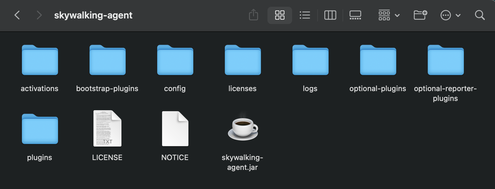

# Skywalking

## 下载JavaAgent

> [Skywalking-Agent下载地址](https://skywalking.apache.org/downloads/#JavaAgent)

## 解压

## 配置

| 属性                                   | 描述                                                         | 默认值             |
| -------------------------------------- | ------------------------------------------------------------ | ------------------ |
| `agent.namespace`                      | 命名空间,用于隔离跨进程传播的header,如果进行了配置,header将为HeaderName:Namespace | 无                 |
| `agent.service_name`                   | 在UI中显示的服务名称                                         |                    |
| `agent.sample_n_per_3_secs`            | 每3秒采样的跟踪数量,负数或零表示关闭                         | 1                  |
| `agent.cause_exception_depth`          | 记录所有异常原因时的代理深度                                 | 5                  |
| `collector.backend_service`            | 后端服务地址                                                 |                    |
| `logging.level`                        | 日志级别                                                     | INFO               |
| `logging.file_name`                    | 日志文件名                                                   | skywalking-api.log |
| `logging.output`                       | 使用`CONSOLE`表示输出到标准输出                              | FILE               |
| `logging.pattern`                      | 日志记录格式。所有转换说明符* %level 表示日志级别。 * %timestamp 表示现在的时间，格式yyyy-MM-dd HH:mm:ss:SSS。 * %thread 表示当前线程的名称。 * %msg 表示消息。 * %class 表示TargetClass的SimpleName。 * %throwable 表示异常。 * %agent_name 表示agent.service_name  |                    |
| `logging.max_file_size`                |                                                              |                    |
| `jvm.buffer_size`                      |                                                              |                    |
| `buffer.channel_size`                  |                                                              |                    |
| `buffer.buffer_size`                   |                                                              |                    |
| `dictionary.service_code_buffer_size`  |                                                              |                    |
| `dictionary.endpoint_name_buffer_size` |                                                              |                    |
| `plugin.peer_max_length`               |                                                              |                    |
| ``                                     |                                                              |                    |
| ``                                     |                                                              |                    |
| ``                                     |                                                              |                    |
| ``                                     |                                                              |                    |
| ``                                     |                                                              |                    |
| ``                                     |                                                              |                    |
| ``                                     |                                                              |                    |
| ``                                     |                                                              |                    |