# Skywalking指标

## 简介

SkyWalking是一个开源的分布式应用性能监控系统，主要用于监控、追踪和诊断微服务架构中的性能问题。它能够收集、分析和展示分布式系统中的各种性能指标，帮助开发者和运维人员更好地了解系统的运行状况，及时发现和解决性能瓶颈

Skywalking主要通过探针来收集各个微服务的性能数据

- **分布式追踪**

  通过分布式追踪技术，SkyWalking能够追踪一个请求在多个微服务中的流转路径并以图表的形式展示，帮助定位哪个服务或哪一部分代码导致了性能瓶颈

- **性能监控**

  SkyWalking能够收集应用程序的各类性能指标，如响应时间、吞吐量、错误率等信息并以图表的形式展示，帮助了解应用的运行状况

- **拓扑图展示**

  通过拓扑图，SkyWalking可以直观地展示微服务之间的调用关系，帮助识别服务间的依赖关系和性能瓶颈

- **日志管理**

  SkyWalking能够集成日志信息，通过分析日志，进一步帮助诊断系统中的问题

- **告警**

  基于设定的指标阈值，SkyWalking可以在检测到异常情况时发出告警，提醒运维人员及时处理
  
  

Skywalking的界面主要通过四个方面来监控信息

- **全局**

  包括所有服务的信息

- **服务**

  某个服务包括其所有实例的信息

- **服务实例**

  某个服务的某个实例的信息

- **端点**

  某个端点的信息

## Global

### Service

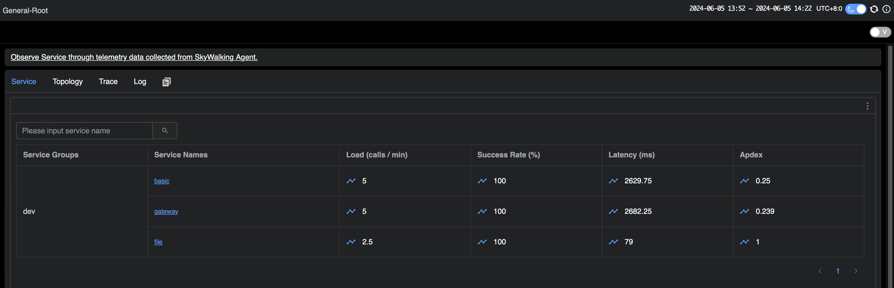

| 指标             | 作用                        |
| ---------------- | --------------------------- |
| Service Groups   | 服务分组                    |
| Service Names    | 服务名                      |
| Load (calls/min) | 服务平均每分钟接受请求次数  |
| Success Rate (%) | 服务平均成功率              |
| Latency (ms)     | 服务平均响应延时，单位:毫秒 |
| Apdex            | 服务评分                    |

点击服务名称会打开新页面展示对应服务信息

### Topology

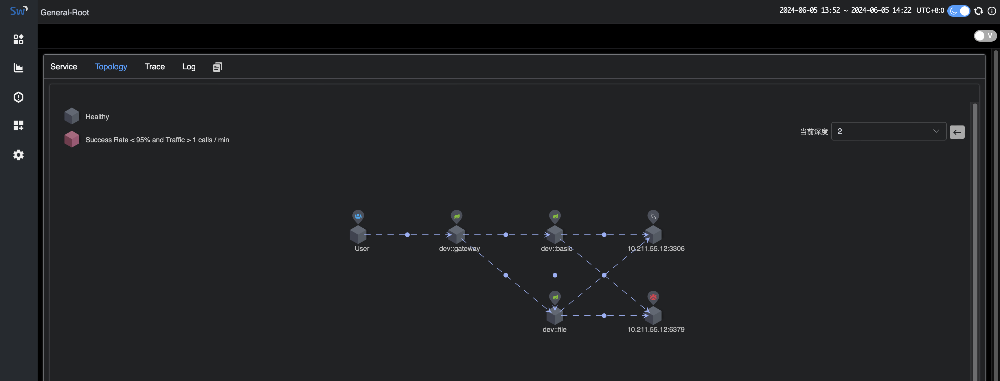

拓扑图，可以通过图标展示服务链路调用信息，以及上下游关系

- 可以调整深度来控制链路的长短

  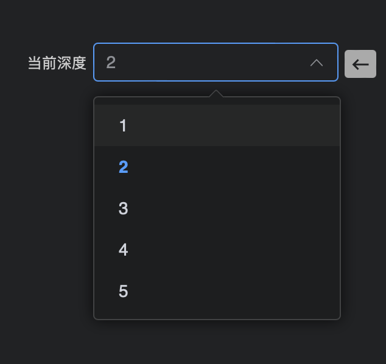

- 鼠标悬停在服务点上方可以查看部份服务信息

  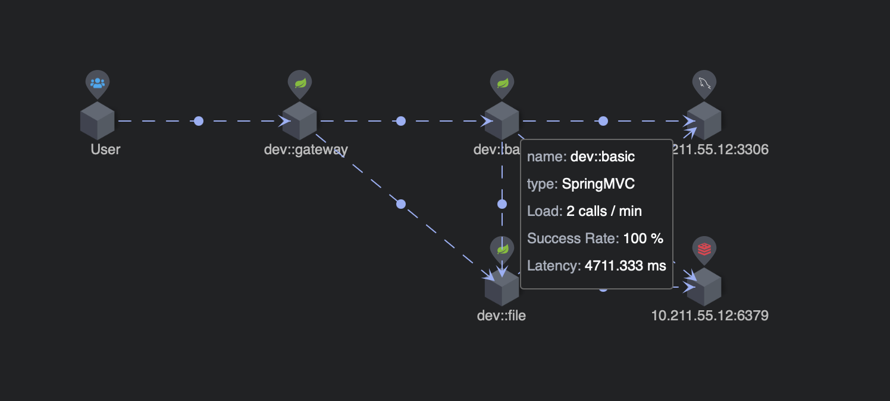

- 根据服务颜色判断服务是否满足左上角指标阈值

- 点击服务可以选择以下选项

  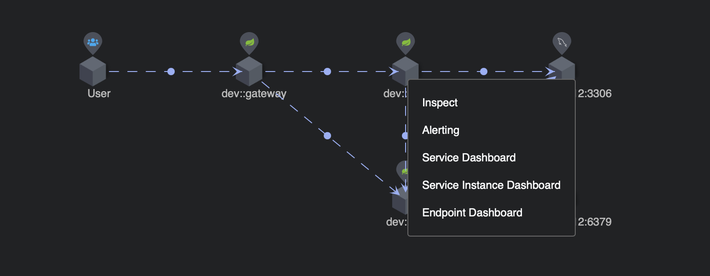

  - Inspect

    只展示当前服务的上下游关系，可以调整深度

  - Alerting

    打开一个新的页面展示告警相关信息

  - Service Dashboard

    打开一个新的页面展示当前服务信息

  - Service Instance Dashboard

    打开一个新的页面展示当前服务实例信息

  - Endpoint Dashboard
  
    打开一个新的页面展示当前服务端点信息

### Trace

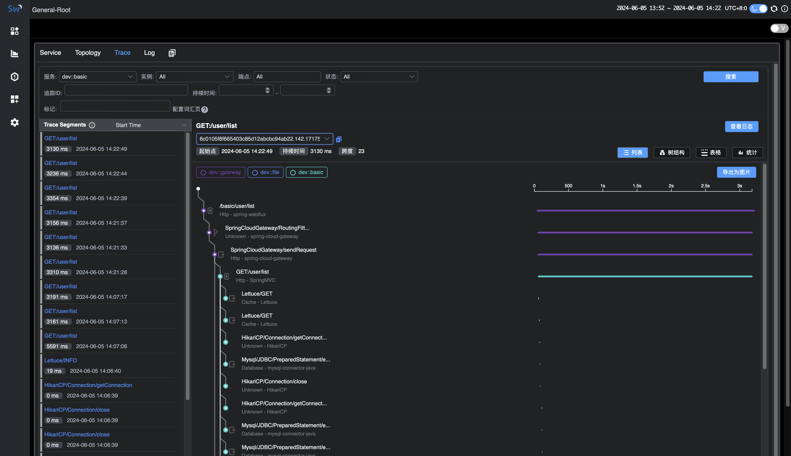

服务链路追踪，可通过实例，端点，状态，追踪ID，持续时间等条件筛选查看具体请求的链路信息，从而快速排查问题

通过可视化图表来展示链路信息，根据需求可选择列表，树结构，表格，统计类型的图表进行展示

- 追踪ID

  追踪ID（TraceID）是分布式追踪的核心概念，它唯一标识了一次请求的调用链路

  例如链路为：A调用B，A调用C，C调用D，以上三次请求的追踪ID会保持一致

  可通过追踪ID来查看一次请求的所有链路调用信息，从而精确高效排查问题

### Log

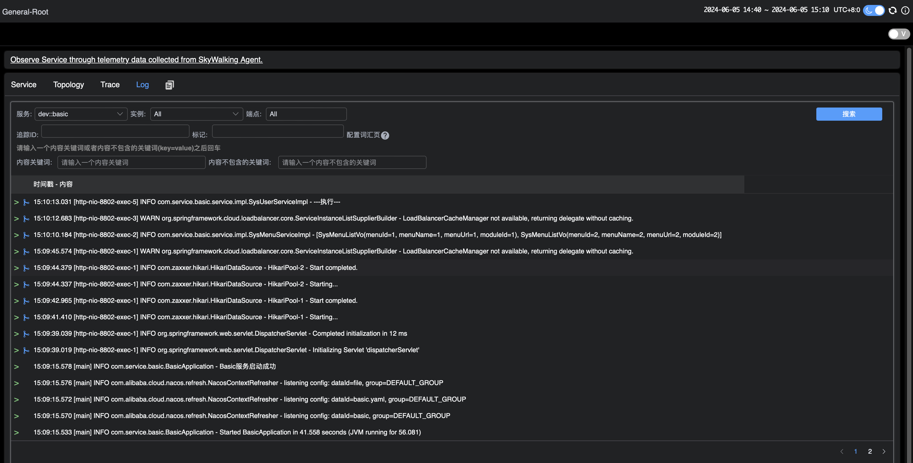

日志信息，可以通过该页面查看服务相关日志信息，可通过条件进行具体的日志筛查

## Service

### Overview

#### Sevice Apdex

服务评分

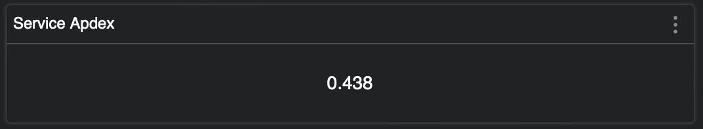

#### Success Rate

服务平均成功率

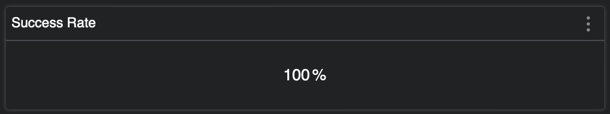

#### Service Load

服务平均每分钟请求数量

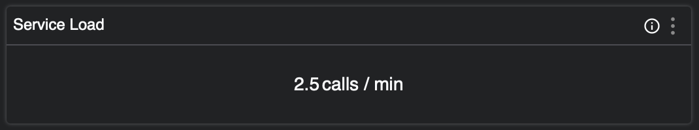

#### Service Avg Response Time (ms)

服务平均响应延时

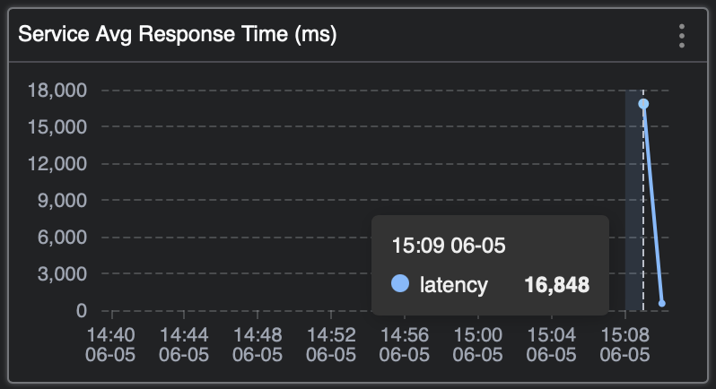

#### Sevice Apdex 折线图

服务评分折线图

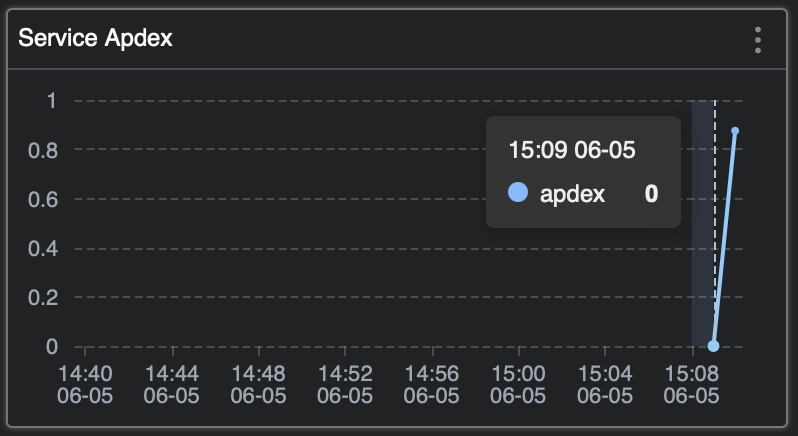

#### Service Response Time Percentile (ms)

服务响应延时百分比，单位:毫秒

如图，有90%的请求响应延时在1360毫秒以下，有75%的请求响应延时在330毫秒以下，有50%的请求响应延时在280毫秒以下

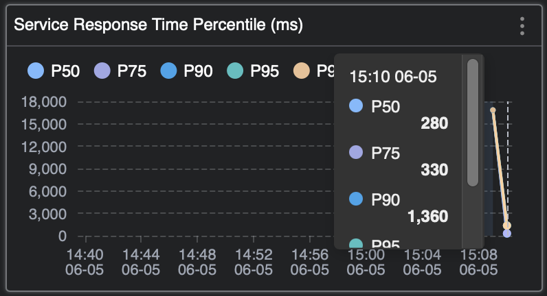

#### Service Load (calls / min)

服务每分钟请求次数

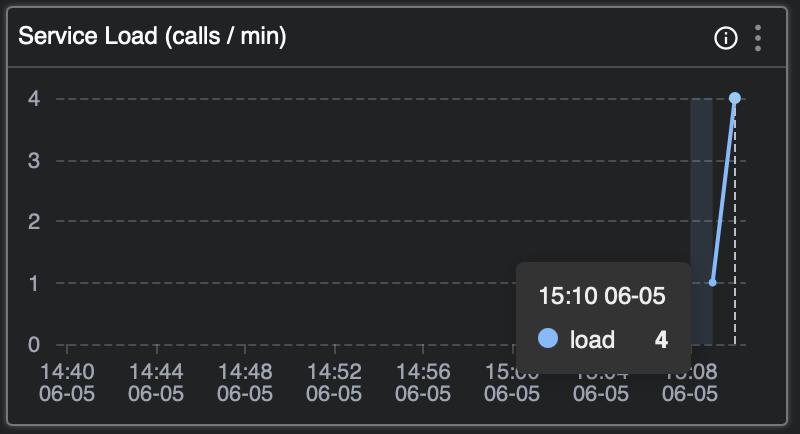

#### Success Rate (%)

服务请求成功率

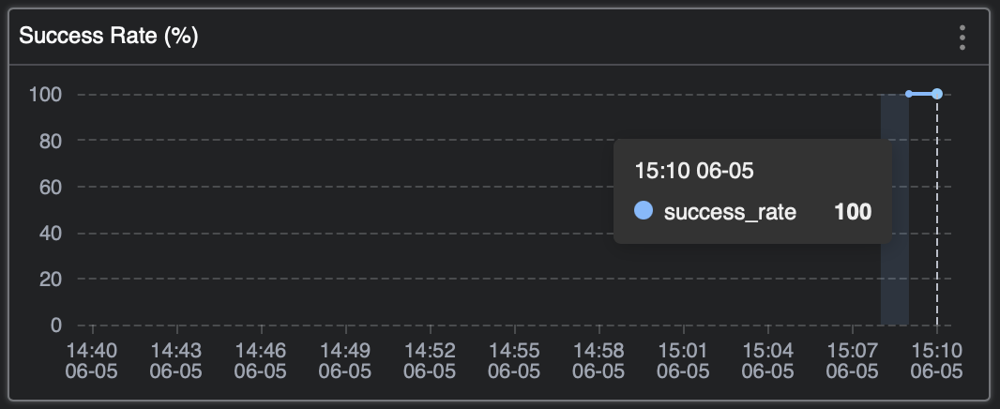

#### Message Queue Consuming Count

消息队列消费数量

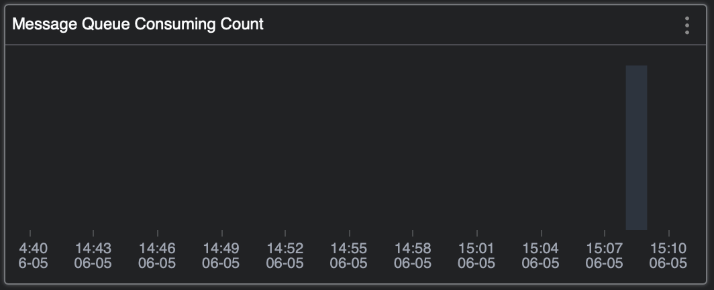

#### Message Queue Avg Consuming Latency (ms)

消息队列平均消费时间

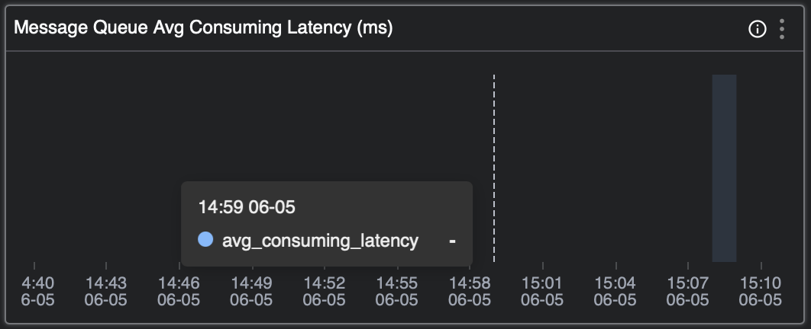

#### Service Instances Load (calls / min)

服务实例的平均每分钟请求次数

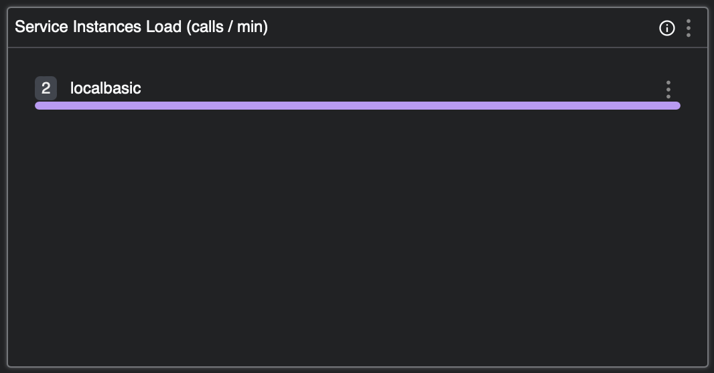

#### Slow Service Instance (ms)

服务实例的平均响应延时

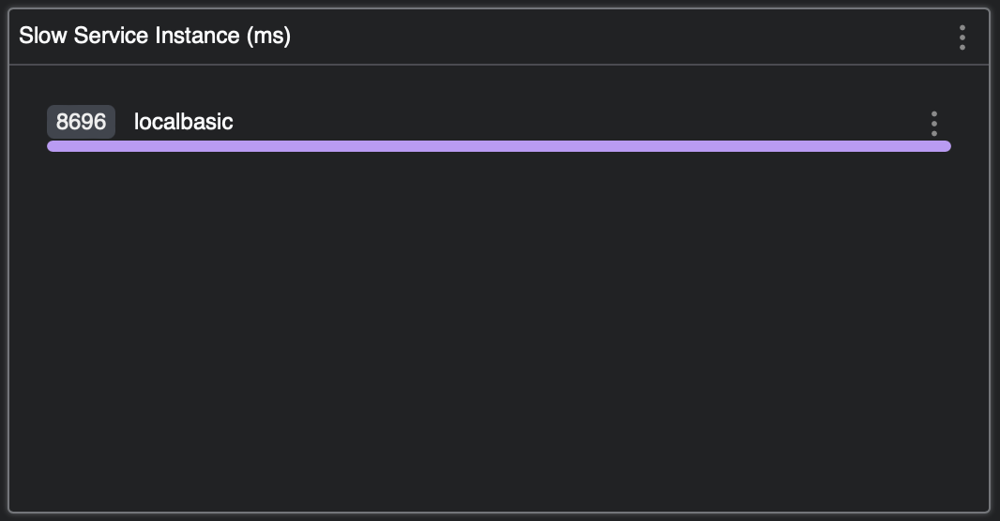

#### Service Instance Success Rate (%)

服务实例的平均请求成功率

#### Endpoint Load in Current Service (calls / min)

端点每分钟请求数量

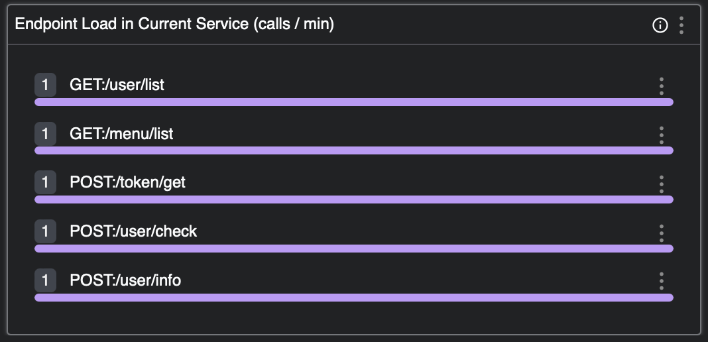

#### Slow Endpoints in Current Service (ms)

端点平均响应延时

#### Endpoint Success Rate in Current Service (%)

每个端点的请求成功率

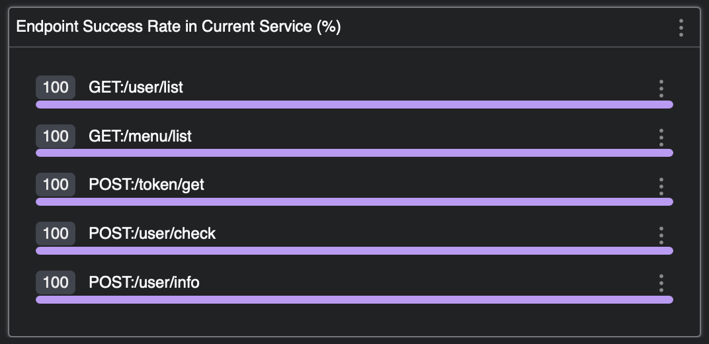

| 指标                                         | 作用                                  |
| -------------------------------------------- | ------------------------------------- |
| Sevice Apdex                                 | 服务评分                              |
| Success Rate                                 | 接口请求成功率，单位:百分比           |
| Service Load (calls/min)                     | 服务接受请求数量                      |
| Service Avg Response Time (ms)               | 服务平均响应延时，单位:毫秒           |
| Service Response Time Percentile (ms)        | 服务响应延时百分比，单位:毫秒         |
| Message Queue Consuming Count                | 消息队列消费数量                      |
| Message Queue Avg Consuming Latency (ms)     | 消息队列平均消费时间                  |
| Servce Instances Load (calls/min)            | 每个服务实例的请求次数                |
| Show Service Instance                        | 每个服务实例的平均响应延时            |
| Service Instance Successful Rate             | 每个服务实例的请求成功率，单位:百分比 |
| Endpoint Load in Current Service             | 端点每分钟请求数量                    |
| Slow Endpoints in Current Service            | 端点平均响应延时，单位:毫秒           |
| Endpoints Successful Rate in Current Service | 每个端点的请求成功率，单位:百分比     |

### Instance

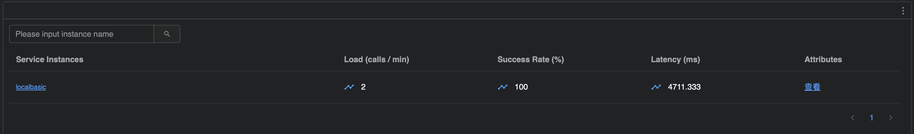

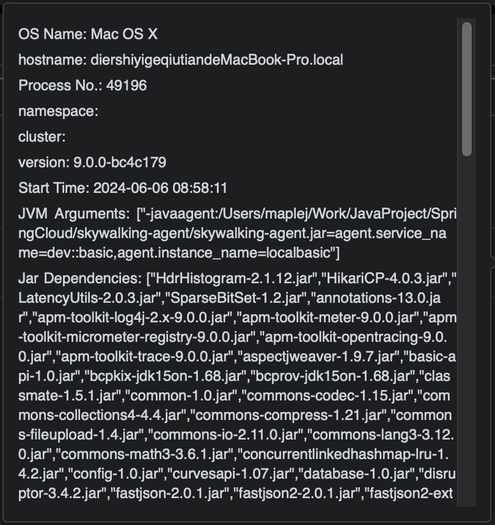

| 名称              | 作用                         |
| ----------------- | ---------------------------- |
| Service Instances | 服务实例名称                 |
| Load (calls/min)  | 该服务实例平均每分钟请求次数 |
| Success Rate (%)  | 该服务实例平均成功率         |
| Latency (ms)      | 该服务实例平均响应延迟       |
| Attributes        | 该实例启动信息               |

点击服务实例名称会打开新页面展示对应实例信息

### Endpoint

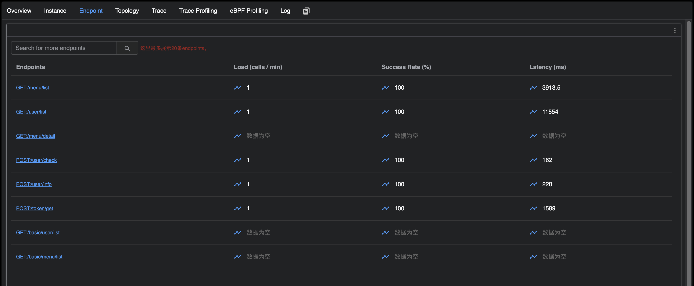

| 指标             | 作用                   |
| ---------------- | ---------------------- |
| Endpints         | 端点名称               |
| Load (calls/min) | 该端点每分钟被请求次数 |
| Success Rate (%) | 该端点平均成功率       |
| Latency (ms)     | 该端点平均响应延时     |

点击端点名称会打开新页面展示对应端点信息

### Topology

拓扑图，展示当前服务调用链路信息及上下游关系，可选择深度

### Trace

当前服务链路追踪信息，在链路追踪中，**Trace（跟踪）** 用于表示一次分布式调用过程

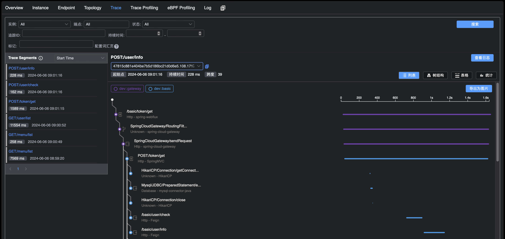

### Trace Porfiling

性能剖析，可以创建任务对指定端点进行堆栈分析，从而查找性能问题所

#### 创建任务

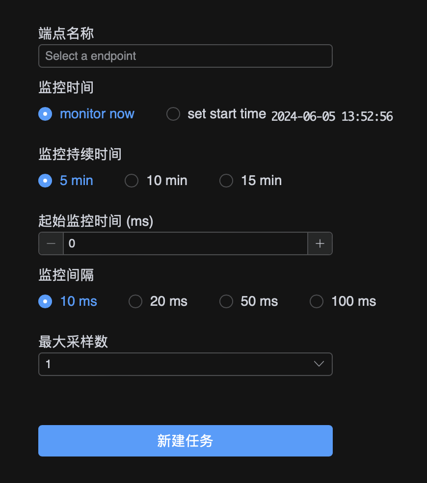

| 选项         | 作用                         |
| ------------ | ---------------------------- |
| 端点名称     | 要监控的端点                 |
| 监控时间     | 从现在开始 或 从指定时间开始 |
| 监控持续时间 | 监控持续时间内会持续采样     |
| 起始监控时间 | 每分钟的多少毫秒开始         |
| 监控间隔     | 监控多久检测一次             |
| 最大采样数   | 采集多少次样本才会停止任务   |

#### 查看采样信息

### Log

日志信息，可以通过该页面查看当前服务相关日志信息，可通过条件进行具体的日志筛查

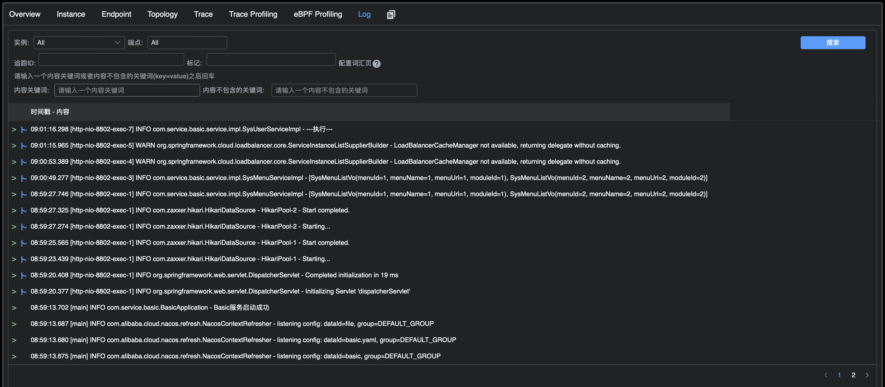

## Service Instance

### Overview

#### Service Instance Load (calls/min)

当前服务实例接收请求数量

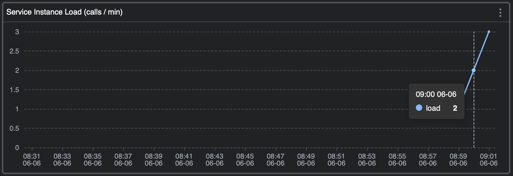

#### Service Instance Success Rate (%)

当前服务实例接收请求的成功率

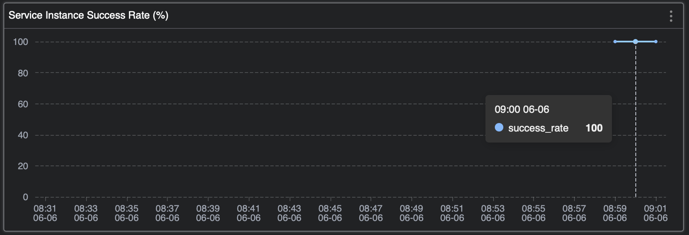

#### Service Instance Latency (ms)

当前服务实例响应延时

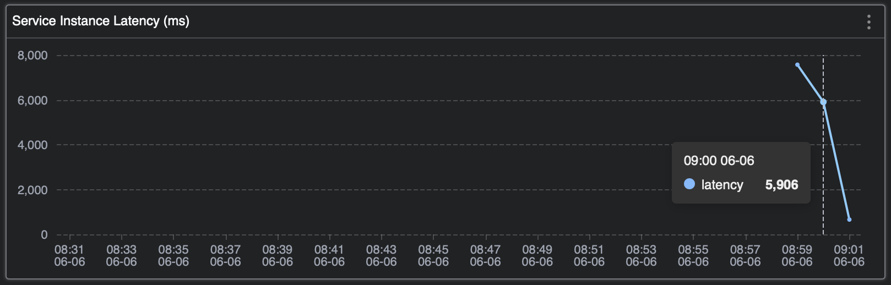

| 指标                              | 作用                                    |
| --------------------------------- | --------------------------------------- |
| Service Instance Load (calls/min) | 当前服务实例接收请求数量                |
| Service Instance Success Rate (%) | 当前服务实例接收请求的成功率，单位:百分 |
| Service Instance Latency (ms)     | 当前服务实例响应延时，单位:毫秒         |
| Database Connection Pool          | 当前服务实例数据库连接池相关信息        |
| Thread Pool                       | 当前服务实例线程池相关信息              |

#### Database Connection Pool

当前服务实例数据库连接池相关信息

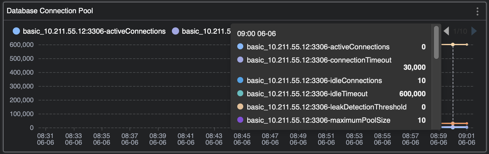

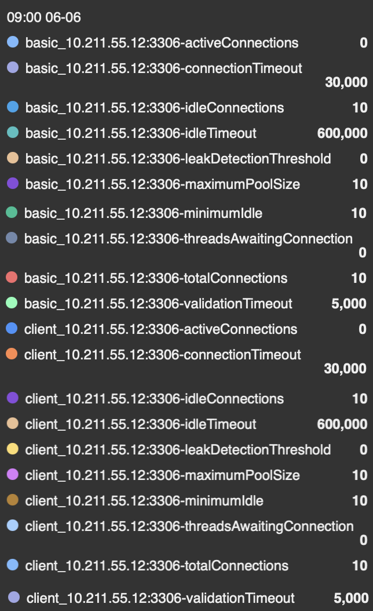

| 指标                      | 作用                               |
| ------------------------- | ---------------------------------- |
| activeConnections         | 当前正在使用的数据库连接数量       |
| connectionTimeout         | 获取数据库连接的最大等待时间       |
| idleConnections           | 当前空闲的数据库连接数量           |
| idleTimeout               | 空闲连接在被关闭前的最大存活时间   |
| leakDetectionThreshold    | 连接泄漏检测的时间阈值             |
| maximumPoolSize           | 连接池中允许的最大连接数量         |
| minimumldle               | 连接池中保持的最小空闲连接数量     |
| threadsAwaitingConnection | 当前等待获取数据库连接的线程数量   |
| totalConnections          | 连接池中活动连接和空闲连接的总数量 |
| validationTimeout         | 连接验证的最大等待时间             |

#### Thread Pool

当前服务实例线程池相关信息

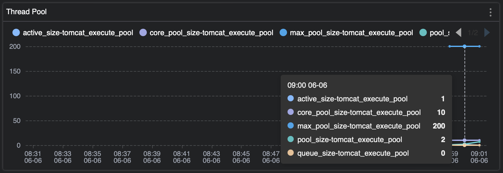

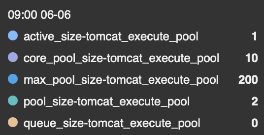

| 指标           | 作用                     |
| -------------- | ------------------------ |
| active_size    | 当前正在执行任务的线程数 |
| core_pool_size | 线程池中核心线程的数量   |
| max_pool_size  | 线程池中允许的最大线程数 |
| pool_size      | 当前线程池中的线程数     |
| queue_size     | 当前等待执行的任务数     |

### Trace

对请求端点的链路进行追踪

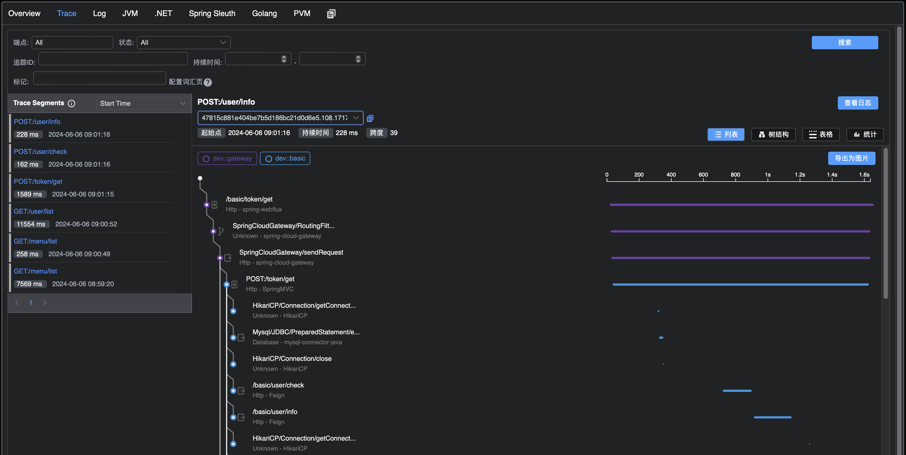

### Log

日志信息，可以通过该页面查看当前服务实例相关日志信息，可通过条件进行具体的日志筛查

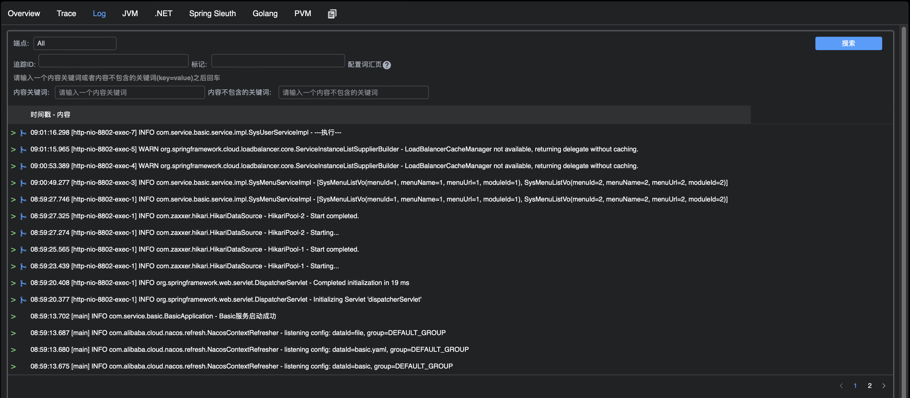

### JVM

#### JVM CPU (%)

JVM相对于宿主机的CPU占用百分比

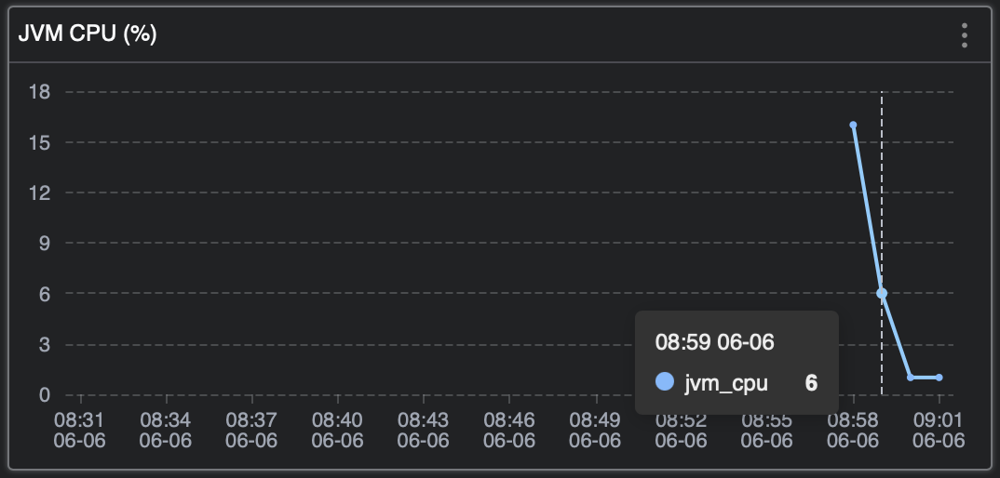

#### JVM Memory (MB)

JVM 内存占用情况

| 指标       | 作用                       |
| ---------- | -------------------------- |
| noheap_max | JVM 中非堆内存的最大限制值 |
| noheap     | JVM 中实际使用的非堆内存量 |
| heap_max   | JVM 中堆内存的最大限制值   |
| heap       | JVM 中实际使用的堆内存量   |

#### JVM Memory Detail (MB)

JVM 内存占用情况

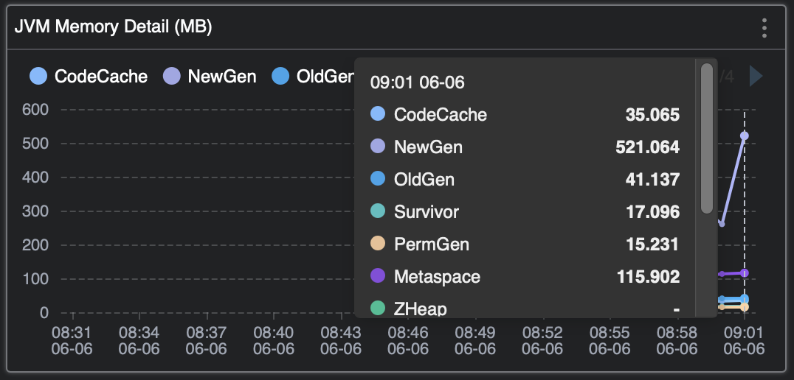

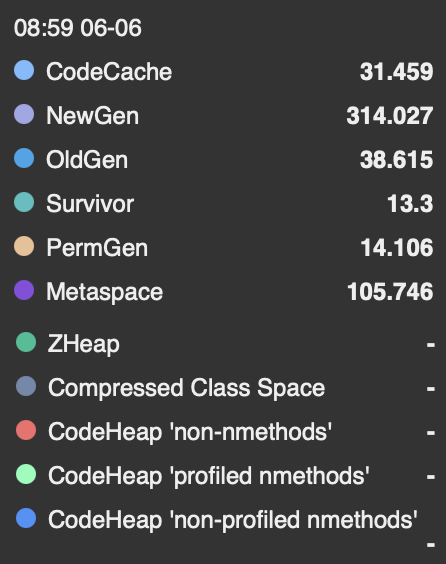

| 指标                             | 作用                                                         |
| -------------------------------- | ------------------------------------------------------------ |
| CodeCache                        | 这是JVM用来存储编译后的本地代码（也称为机器码）的区域        |
| NewGen                           | 堆内存的一部分，用于存放新生代对象                           |
| OldGen                           | 堆内存的一部分，用于存放老年代对象                           |
| Survivor                         | 新生代中的两个区，称为Survivor 0和Survivor 1，对象在这两个区域之间移动，直到被提升到老年代 |
| PermGen                          | 用于存放类元数据（如类定义、方法定义）的区域                 |
| Metaspace                        | 用于存放类元数据                                             |
| ZHeap                            | 这是用于ZGC（Z Garbage Collector）中的堆内存。ZGC是一个低延迟垃圾收集器 |
| Compressed Class Space           | 在启用类空间压缩（Compressed Class Space）时，用于存放压缩的类元数据 |
| CodeHeap 'non-nmethods'          | 存放非nmethod的代码                                          |
| CodeHeap 'profiled nmethods'     | 存放经过性能分析的nmethod代码                                |
| CodeHeap 'non-profiled nmethods' | 存放未经性能分析的nmethod代码                                |

#### JVM GC Time (ms)

JVM 垃圾回收时间所消耗的时间

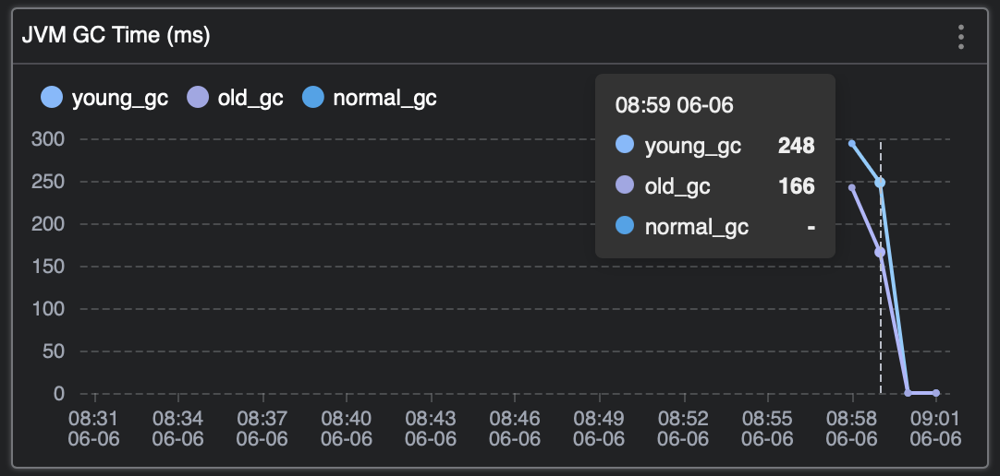

| 指标      | 作用       |
| --------- | ---------- |
| young_gc  | 新生代回收 |
| old_gc    | 老年代回收 |
| normal_gc | 正常回收   |

#### JVM GC Count

JVM 垃圾回收次数

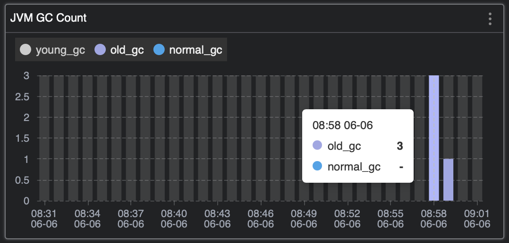

#### JVM Thread Count

当前实例的线程数量

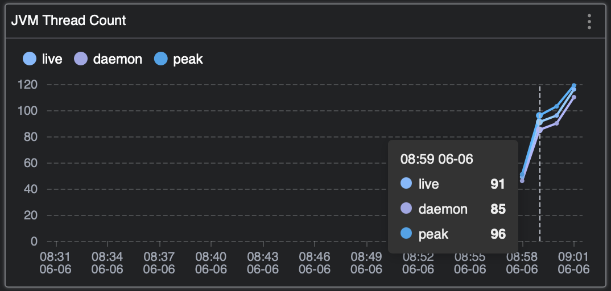

| 指标   | 作用               |
| ------ | ------------------ |
| live   | 活动线程数量       |
| daemon | 守护线程数量       |
| peak   | 活动线程的峰值数量 |

#### JVM Thread State Count

当前实例的各状态线程数量

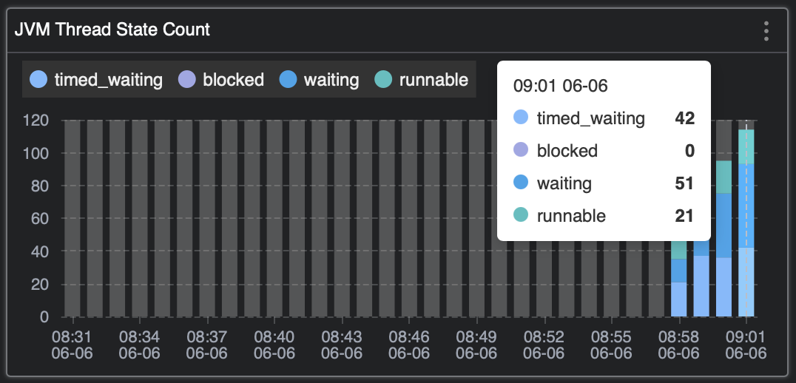

| 指标          | 作用         |
| ------------- | ------------ |
| timed_waiting | 计时等待状态 |
| blocked       | 阻塞状态     |
| waiting       | 等待状态     |
| runnable      | 可运行状态   |

#### JVM Class Count

当前实例加载类的数量

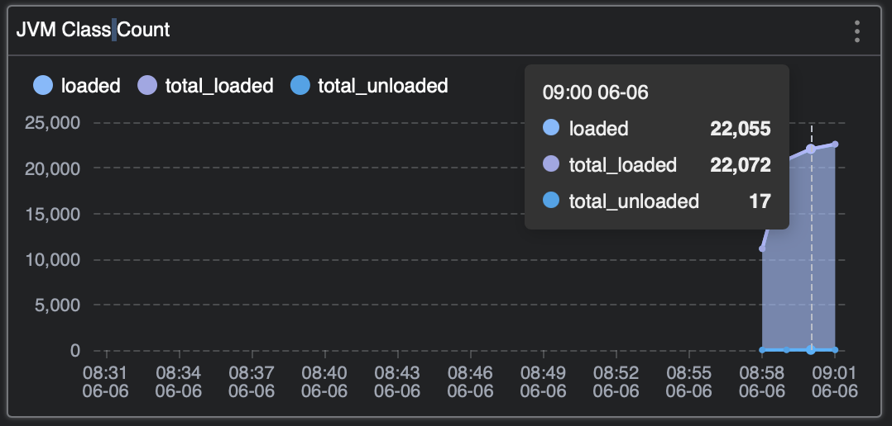

| 指标           | 作用               |
| -------------- | ------------------ |
| loaded         | 已加载的类的数量   |
| total_loaded   | 总共加载的类的数量 |
| total_unloaded | 卸载的类的数量     |

| 指标                   | 作用                                    |
| ---------------------- | --------------------------------------- |
| JVM CPU (%)            | JVM相对于宿主机的CPU占用百分比          |
| JVM Memory (MB)        | JVM 内存占用情况，单位:MB               |
| JVM Memory Detail (MB) | JVM 内存占用情况详情，单位:MB           |
| JVM GC Time (ms)       | JVM 垃圾回收时间所消耗的时间，单位:毫秒 |
| JVM GC Count           | JVM 垃圾回收次数量                      |
| JVM Thread Count       | 当前实例的线程数量                      |
| JVM Thread State Count | 当前实例的各状态线程数量                |
| JVM Class Count        | 当前实例加载类的数量                    |

## Service Endpoint

### Overview

#### Endpoint Load (calls/min)

端点每分钟请求次数

#### Endpoint Success Rate (%)

端点请求成功率

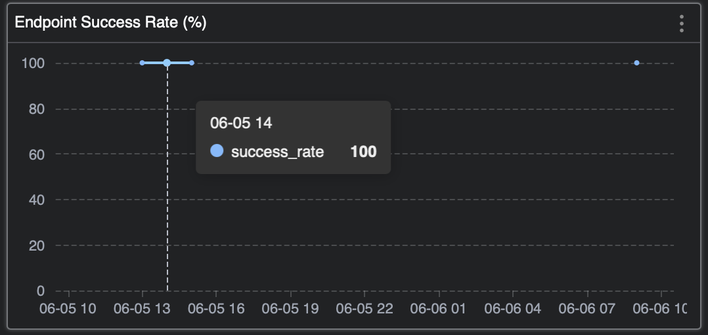

#### Endpoint Avg Response Time (ms)

端点平均响应延时

#### Endpoint Response Time Percentile (ms)

端点响应延时百分比

#### Message Queue Avg Consuming Latency (ms)

消息队列平均消费时间

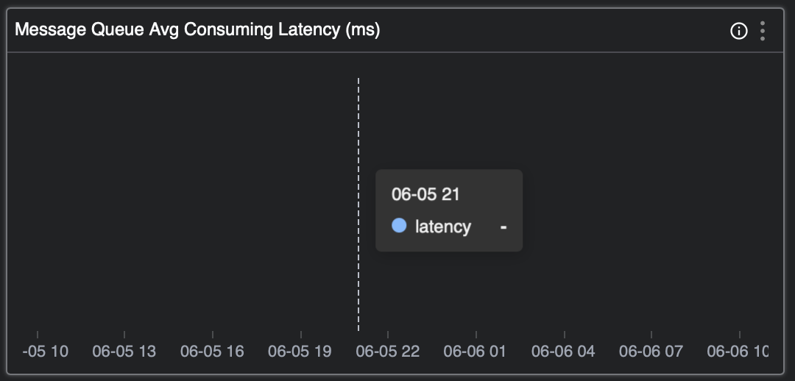

| 指标                                     | 作用                          |
| ---------------------------------------- | ----------------------------- |
| Endpoint Load (calls/min)                | 端点每分钟请求次数            |
| Endpoint Success Rate (%)                | 端点请求成功率                |
| Endpoint Latency (ms)                    | 端点延时，单位:毫秒           |
| Endpoint Avg Response Time (ms)          | 端点平均响应延时，单位:毫秒   |
| Endpoint Response Time Percentile (ms)   | 端点响应延时百分比，单位:毫秒 |
| Message Queue Avg Consuming Latency (ms) | 消息队列平均消费时间          |

### Topology

拓扑图，展示当前服务实例端点调用链路信息及上下游关系，可选择深度

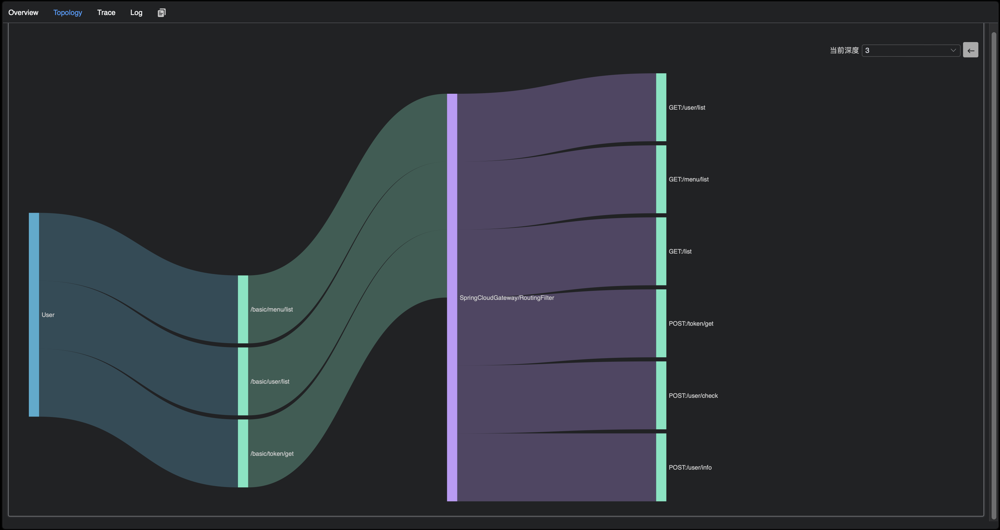

### Trace

对请求端点的链路进行追踪

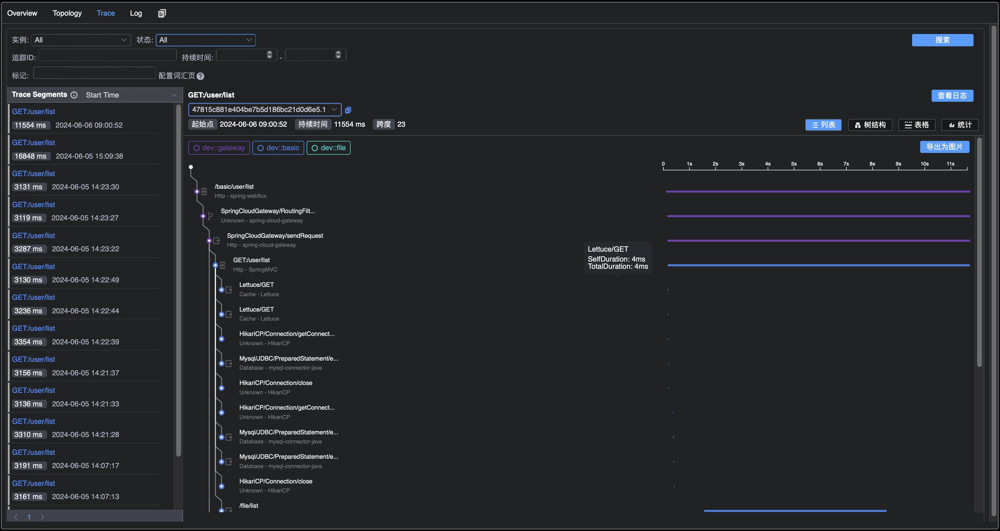

### Log

日志信息，可以通过该页面查看当前端点相关日志信息，可通过条件进行具体的日志筛查

## 告警

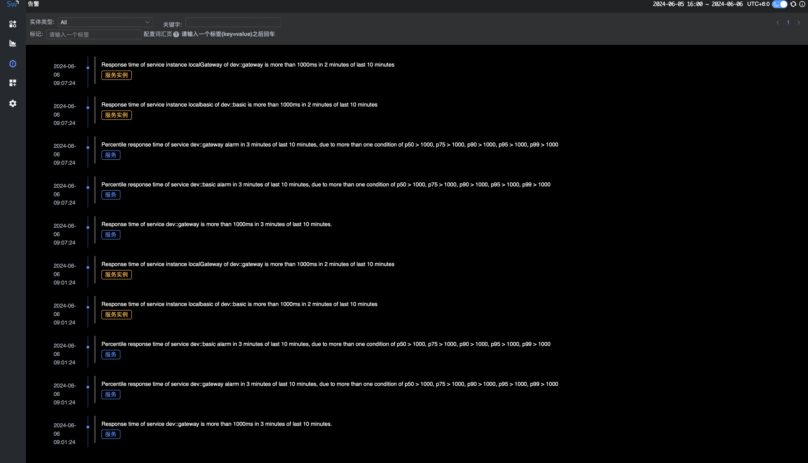

- **规则定义**

  支持基于多种指标（如响应时间、错误率、吞吐量等）定义告警规则，用户可以自定义告警策略，以满足不同业务需求

- **多级告警**

  支持不同级别的告警，如警告、错误、致命等。不同级别的告警可以触发不同的响应措施

- **告警通知**

  支持多种通知方式，包括电子邮件、短信、钉钉、Slack 等。确保相关人员能够及时接收到告警信息

  可以集成其他第三方告警处理平台，实现更复杂的告警处理流程

- **告警聚合**

  能够对短时间内发生的多个相似告警进行聚合，简化告警管理，减少不必要的干扰

**docker配置文件路径**

> /skywalking/config/alarm-settings.yml

**官方文档**

> https://skywalking.apache.org/docs/main/v9.7.0/en/setup/backend/backend-alarm/#default-alarm-rules
