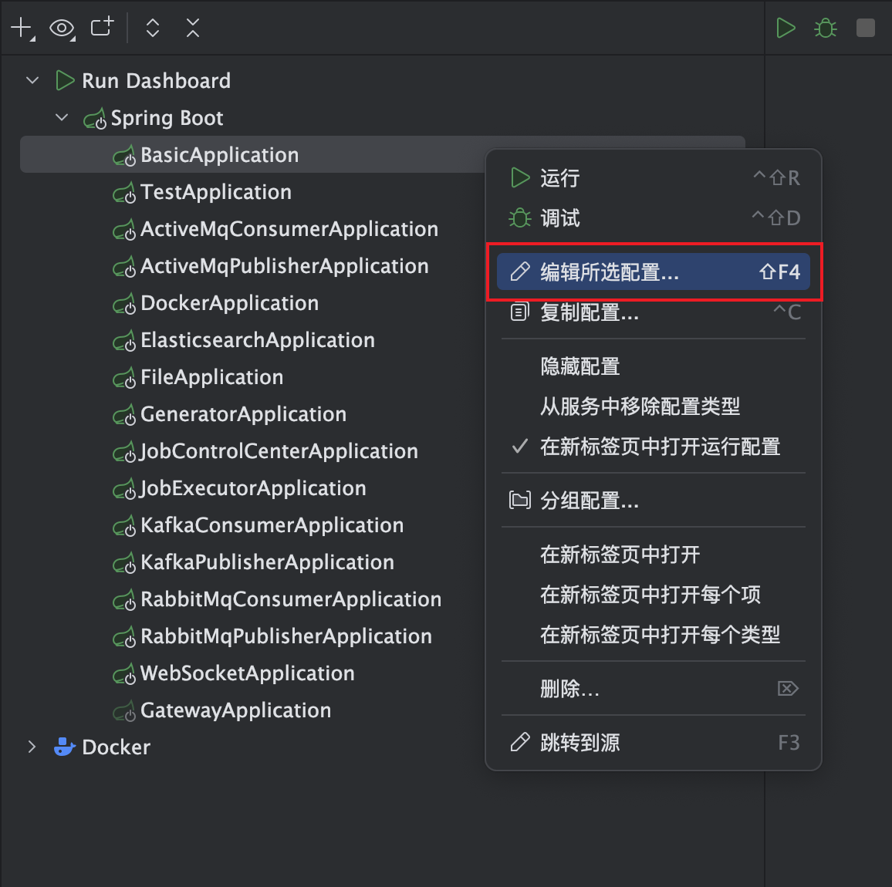
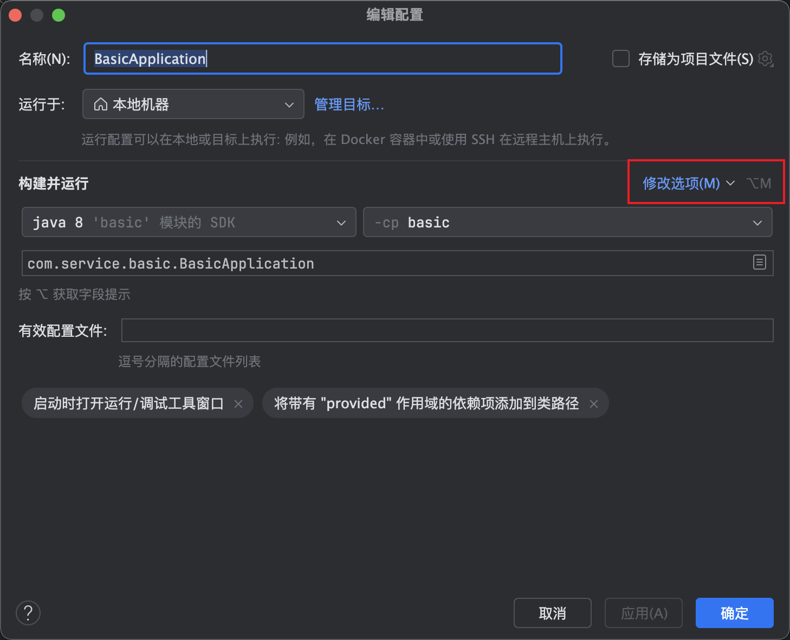
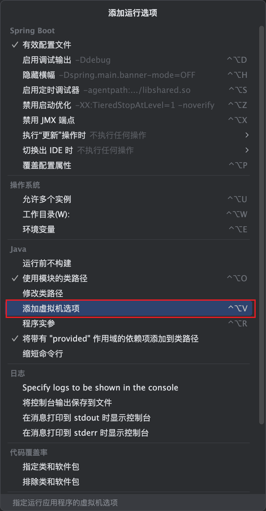
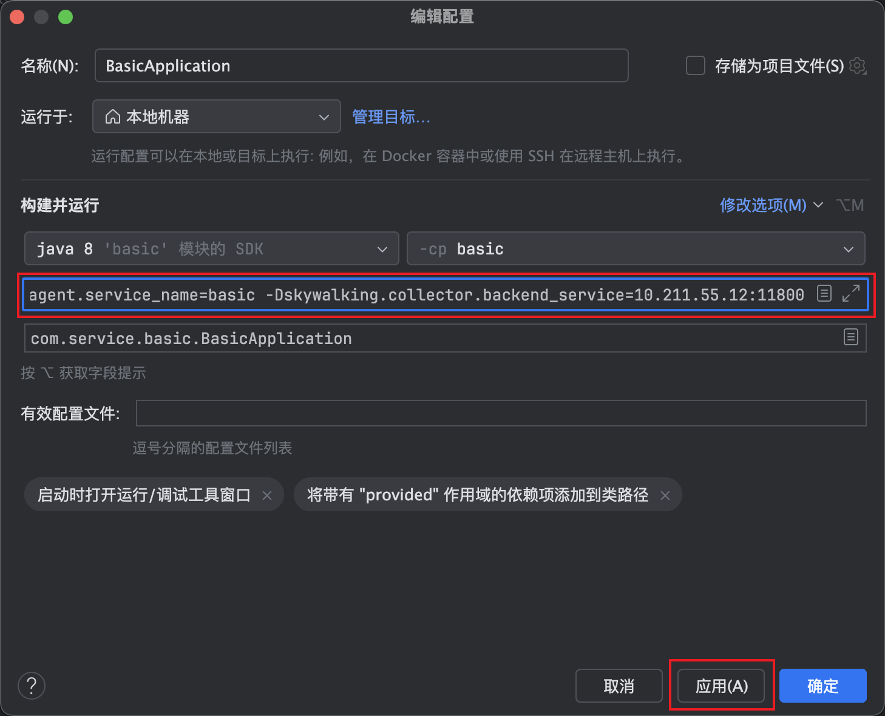

# Skywalking配置

1. 访问Skywalking官网

   https://skywalking.apache.org/downloads/#JavaAgent

2. 下载 JavaAgent

3. 将下载的压缩包解压病Copy到项目中

4. 按照一下步骤配置

   

   

   

   

   ```java
   -javaagent:/Users/maplej/Work/JavaProject/SpringCloud/jar/skywalking-agent/skywalking-agent.jar=agent.service_name=basic,collector.backend_service=10.211.55.12:11800
   ```

5. 启动项目

6. 查看Skywalking控制台